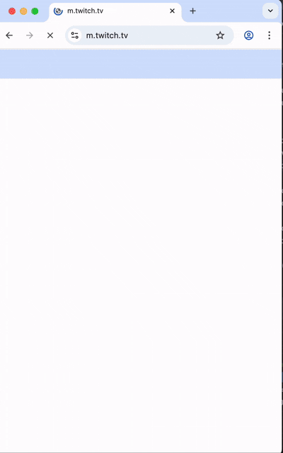

# WAP Web UI Automation

A Python-based test automation framework built with Selenium and Pytest to validate video playback functionality on Twitch's mobile webpage.

## Features

- Page Object Model structure
- Scrolling and UI interaction
- Automated search and selection of video
- Video playback readiness checks
- Screenshot capture for debugging

## Structure

```
.
├── pages/                # Page Object Model classes
│   ├── base_page.py      # Base class with common methods
│   ├── homepage.py       # Actions and locators for the homepage
│   ├── browse_page.py    # Actions and locators for the Browse Page
│   ├── browse_page.py    # Actions and locators for the Streamer Page
│
├── tests/                # Test script
│   └── test_search.py    # Test case for search and streaming
│
├── screenshots/          # Screenshots taken during automation
│
├── conftest.py           # Pytest fixtures
├── requirements.txt      # All required dependencies
└── README.md             # Project documentation
```

## Demo



---

## Getting Started

### 1. Clone the repository
```commandline
git clone https://github.com/ecchsu/WAP.git
```

### 2. Install dependencies
```commandline
pip install -r requirements.txt
```
### 3. Run test
```commandline
pytest tests/test_search.py
```